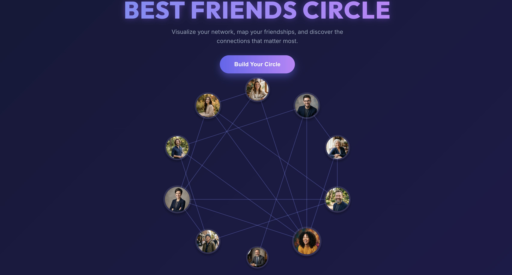

# Circle of Friends

An interactive, graph-theory-based web application to visually map and explore your closest friendships and social networks.

👉 **[Read the full Case Study here!](CASE_STUDY.md)**

## Screenshot & Demo



## Problem and Approach

**The Problem:** The original project was a simple, static grid-based layout of profile cards. It lacked dynamic interactivity and provided no meaningful insight into how people were actually connected.

**The Approach:** I completely reimagined the application from the ground up, transforming it into a dynamic circular network graph. 
- **Graph Theory & Visualization:** By leveraging trigonometric positioning (`Math.sin` and `Math.cos`) and SVG edge routing, I created a circular layout where node sizes scale dynamically based on their "degree centrality" (number of connections).
- **Interactive UI:** Users can now build their *own* custom circles from an empty slate, adding real friends and manually drawing connections (e.g., "Coworker", "Gym Buddy"). Hovering over a person instantly highlights their entire personal network while dimming others.
- **Aesthetics:** I implemented a modern glassmorphic design system with vibrant gradients, glowing edges, and smooth micro-animations to create a premium, engaging user experience.

## Tech Stack

- **React:** For state management and component architecture.
- **Vite:** For lightning-fast local development and optimized production builds.
- **Vanilla CSS:** Custom CSS for glassmorphism, responsive design, and animations (no bulky frameworks).
- **SVG:** For precise, mathematically calculated interactive edge drawing between nodes.

## Setup Steps

To run this project locally, execute the following commands in your terminal:

```bash
# Clone the repository
git clone https://github.com/nanaNdrew/best-friends-circle.git

# Navigate into the directory
cd best-friends-circle

# Install the necessary dependencies
npm install

# Start the Vite development server
npm run dev
```

## Notes and Trade-offs

- **Layout Choice:** I opted for a fixed, mathematically calculated circular layout rather than a physics-based force-directed graph (like D3.js). This trade-off significantly reduces bundle size, eliminates the need for heavy third-party libraries, and ensures perfectly predictable and performant React rendering for up to ~20 nodes.
- **State Management:** Currently, the custom network state (nodes and relationships) is maintained entirely in local React state (`useState`). This means the custom graph resets on a page refresh. A logical next step for scalability would be adding `localStorage` persistence or integrating a lightweight backend database to save user circles.
